# Architecture & Decision Logic

> A human-readable guide to how the arbitrage bot detects, evaluates, and
> executes trades.  Every threshold, formula, and decision gate is documented
> here so an engineer can reason about the system without reading every source
> file.

---

## 1. System Overview

### High-level architecture

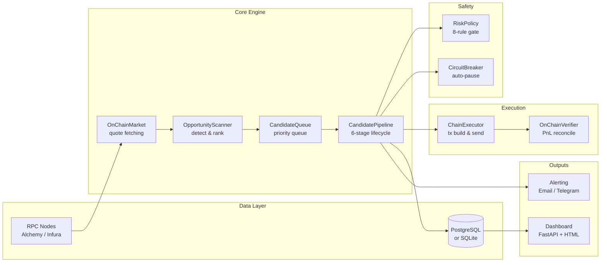

### Threading model

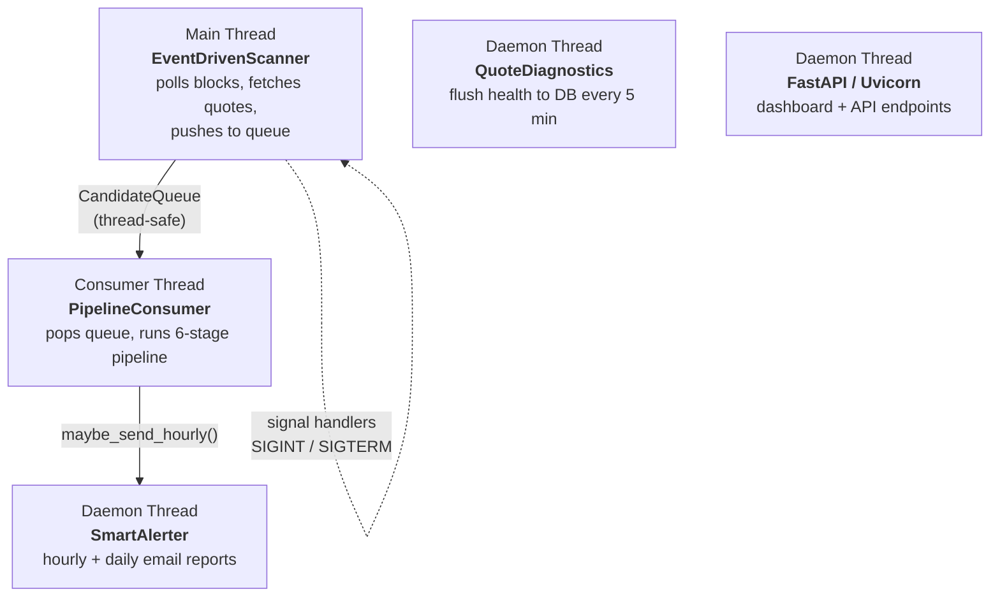

### Data flow

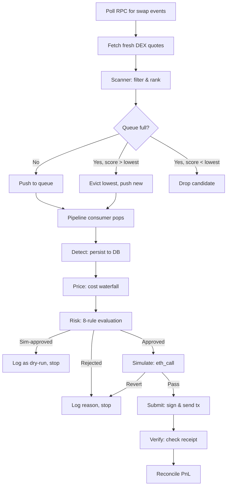

---

## 2. Opportunity Detection (`scanner.py`)

### What it does

For every scan cycle the scanner fetches fresh quotes from all configured DEXes
and chains, then evaluates **every cross-DEX pair** looking for price
discrepancies that survive the cost model.

### Scanner workflow

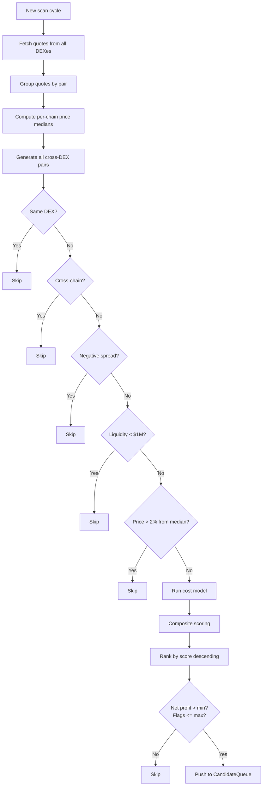

### Filtering pipeline (applied in order)

| Filter | Rule | Why |
|--------|------|-----|
| Same-DEX | Skip if `buy_dex == sell_dex` | No arbitrage possible |
| Cross-chain | Skip if buy and sell are on different chains | Cannot execute atomically |
| Negative spread | Skip if `sell_price <= buy_price` after fees | Unprofitable |
| Low liquidity | Skip if `min(buy_liq, sell_liq) < $1M` | Execution risk too high |
| Price outlier | Skip if price deviates > 2% from chain median | Likely stale/bad quote |

### Composite scoring

Every surviving opportunity gets a **composite score** (0.0 - 1.0):

```
score = 0.50 * profit_score     profit / 1.0 WETH, capped at 1.0
      + 0.25 * liquidity_score  log10(min_liq) / 7.0, capped at 1.0
      + 0.15 * flag_score       1.0 - (warning_count * 0.25), min 0
      + 0.10 * spread_score     spread_pct / 5.0, capped at 1.0
```

**Why these weights:** Profit is most important but a thin pool with a fat
spread is a trap.  Liquidity and warning flags prevent the bot from chasing
mirages.

### Warning flags

| Flag | Condition | Meaning |
|------|-----------|---------|
| `low_liquidity` | `min_liquidity < $100K` | Pool too thin, likely slippage |
| `thin_market` | `min_volume < $50K` | Low trading activity |
| `stale_quote` | `quote_age > 60s` | Price may have moved |
| `high_fee_ratio` | `(fees + flash + slippage) / gross_spread > 80%` | Costs eat most of the profit |

---

## 3. Cost Model & Net Profit (`strategy.py`)

Every opportunity goes through a full cost waterfall before profit is
calculated.  **All intermediate math uses `Decimal` — never `float`.**

### Cost waterfall diagram

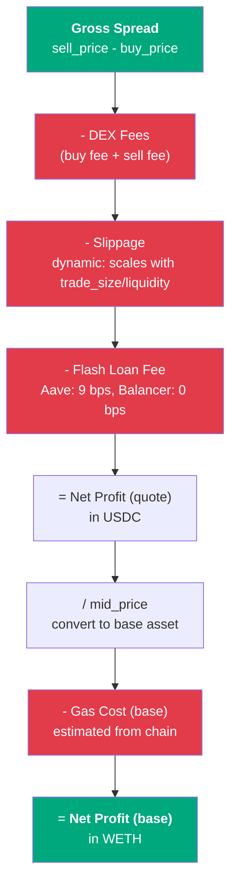

### Formula

```
buy_cost      = trade_size * buy_price / (1 - fee_bps/10000)   [if fees not pre-included]
sell_proceeds = trade_size * sell_price * (1 - fee_bps/10000)   [if fees not pre-included]

slippage_cost = buy_cost * base_slippage * (1 + trade_size / liquidity)
flash_fee     = buy_cost * flash_loan_fee_bps / 10000

net_profit_quote = sell_proceeds - buy_cost - slippage_cost - flash_fee
net_profit_base  = (net_profit_quote / mid_price) - gas_cost_base
```

### Key parameters

| Parameter | Typical value | Source |
|-----------|--------------|--------|
| `trade_size` | 1-3 WETH | Config |
| `fee_bps` | 30 (standard V3 pool) | Pool-specific |
| `slippage_bps` | 10-15 | Config |
| `flash_loan_fee_bps` | 9 (Aave V3), 0 (Balancer) | Config |
| `gas_cost_base` | ~0.003 ETH (Arbitrum), ~0.01 ETH (Ethereum) | Estimated at runtime |

### Fee-included vs. calculated

On-chain quoters (Uniswap V3 `quoteExactInputSingle`) return amounts with
fees already deducted.  When `fee_included=True` the cost model skips the
fee adjustment to avoid double-counting.

### Liquidity score

```python
score = min(1.0, log10(min_liquidity_usd) / 7.0)
```

- `$10M+ TVL` -> 1.0 (saturated)
- `$1M TVL` -> 0.86
- `$100K TVL` -> 0.71
- `$10K TVL` -> 0.57

---

## 4. Risk Policy (`risk/policy.py`)

Once an opportunity is priced, the risk policy runs **eight sequential
checks**.  A failure at any step is a **hard veto** — the opportunity is
rejected immediately.

### Risk evaluation flowchart

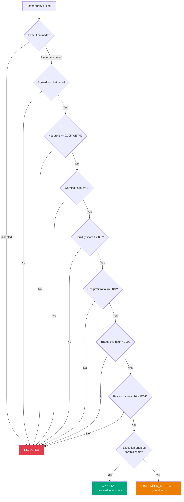

### Evaluation order

| # | Rule | Threshold (default) | Why |
|---|------|---------------------|-----|
| 1 | **Execution mode** | Per-chain: `live` / `simulated` / `disabled` | Prevents accidental trades on wrong chains |
| 2 | **Minimum spread** | Ethereum: 0.40%, Arbitrum: 0.20%, Base/Optimism: 0.15% | Must exceed chain-specific gas + fee floor |
| 3 | **Minimum net profit** | 0.005 WETH (~$12) | Below this, gas variance can flip trade negative |
| 4 | **Warning flags** | max 1 flag allowed | Multiple flags = compounding risk |
| 5 | **Liquidity score** | min 0.3 | Pools below this risk slippage blow-up |
| 6 | **Gas-to-profit ratio** | max 50% | If gas eats >50% of profit, variance is too high |
| 7 | **Rate limiting** | max 100 trades/hour | Prevents execution clustering |
| 8 | **Exposure limit** | max 10 WETH per pair | Prevents concentration in one pair |

### Per-chain spread thresholds

These are calibrated to each chain's gas cost:

```
Ethereum:   0.40%   (gas ~$2-5, need bigger spread to cover)
Arbitrum:   0.20%   (gas ~$0.10)
Base:       0.15%   (gas ~$0.05)
Optimism:   0.15%   (gas ~$0.05)
Polygon:    0.20%
BSC:        0.20%
Avalanche:  0.25%
```

### Simulation-approved path

If all rules pass but execution is disabled for the chain, the policy returns
`simulation_approved` instead of `approved`.  This opportunity appears in the
dashboard as "would have executed" — useful for strategy tuning without risk.

---

## 5. Circuit Breaker (`risk/circuit_breaker.py`)

An automatic safety mechanism that **pauses all execution** when the system
detects degraded conditions.

### State machine

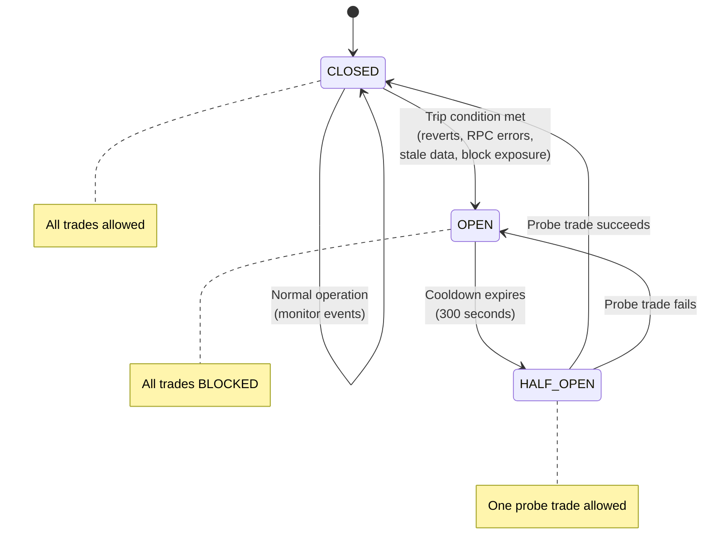

### Trip conditions

| Condition | Threshold | Window | Reason |
|-----------|-----------|--------|--------|
| Repeated reverts | 3 reverts | 5 minutes | Contract/market conditions changed |
| RPC degradation | 5 errors | 60 seconds | Node is failing, quotes unreliable |
| Stale data | No fresh quote | 120 seconds | Market data too old to trust |
| Block window exposure | 3 trades | 10 blocks | Too many trades too fast |

### Recovery

After **300 seconds** (5 min) cooldown, the breaker enters `HALF_OPEN`:
- One "probe" trade is allowed through
- If it succeeds: breaker resets to `CLOSED`
- If it fails (revert): breaker goes back to `OPEN`

---

## 6. Pipeline Lifecycle (`pipeline/lifecycle.py`)

Every opportunity flows through a **six-stage pipeline**.  Each stage persists
its result to the database before proceeding.  A failure at any stage stops the
pipeline for that opportunity.

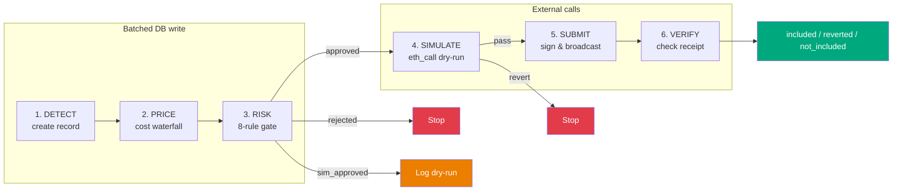

### Timing instrumentation

Every stage is timed in milliseconds.  The `total_ms` and per-stage breakdown
are logged and stored in `logs/latency.jsonl` for performance analysis.

### Batch persistence

Stages 1-3 (detect, price, risk) are batched into a single DB transaction to
reduce round-trips.  Stages 4-6 persist independently since they involve
external calls (RPC, mempool).

---

## 7. Priority Queue (`pipeline/queue.py`)

A **bounded, thread-safe priority queue** sits between the scanner and the
pipeline consumer.

| Property | Value |
|----------|-------|
| Max size | 100 (configurable) |
| Priority | `composite_score` from scanner (0.0 - 1.0) |
| Eviction | When full, lowest-priority candidate is dropped |
| Extraction | Highest priority first |

### Back-pressure

When the queue is full and a new candidate arrives:
1. If new candidate's score < lowest in queue: **drop the new one**
2. Otherwise: **evict the lowest**, insert the new one

This ensures the pipeline always processes the best available opportunities.

---

## 8. On-Chain Execution (`chain_executor.py`)

### Execution workflow

```mermaid
flowchart TD
    OPP[Approved opportunity] --> RESOLVE[Resolve token addresses<br/>from CHAIN_TOKENS registry]
    RESOLVE --> ROUTER[Look up swap router<br/>for buy_dex and sell_dex]
    ROUTER --> TYPE{Swap type?}
    TYPE -->|Uniswap/Sushi/Pancake| V3["V3 swap<br/>exactInputSingle()"]
    TYPE -->|Velodrome/Aerodrome| VELO["Solidly swap<br/>swapExactTokensForTokens()"]
    V3 --> BUILD[Build executeArbitrage() calldata]
    VELO --> BUILD
    BUILD --> GAS[Estimate gas * 1.2x buffer]
    GAS --> SIM{Simulate via eth_call}
    SIM -->|Reverts| ABORT[Abort — no gas spent]
    SIM -->|Success| CHAIN{Which chain?}
    CHAIN -->|Ethereum| FB[Flashbots bundle<br/>target: current_block + 1]
    CHAIN -->|L2s| PUB[Public mempool]
    FB --> WAIT[Wait for receipt<br/>timeout: 120s]
    PUB --> WAIT
    WAIT --> VERIFY[Verify outcome]

    style ABORT fill:#e23b4a,color:#fff
    style FB fill:#494fdf,color:#fff
    style PUB fill:#494fdf,color:#fff
```

### Transaction building

1. Resolve token addresses from `CHAIN_TOKENS` registry
2. Look up swap router address for the DEX on this chain
3. Determine swap type: `V3` (Uniswap-style) or `VELO` (Velodrome/Aerodrome)
4. Encode `executeArbitrage(baseToken, quoteToken, buyRouter, sellRouter, feeTier, amount, minProfit, ...)`

### Swap types

| Type | ID | DEXes | Router interface |
|------|----|-------|------------------|
| V3 | 0 | Uniswap V3, Sushi V3, PancakeSwap V3 | `exactInputSingle()` |
| Velodrome | 1 | Velodrome V2, Aerodrome | `swapExactTokensForTokens()` |

### Gas estimation

```
estimate = eth_estimateGas(tx_data) * 1.2   (20% safety buffer)
fallback = 500,000 gas                       (if estimation fails)
```

Why 1.2x: accounts for ~10% variance between estimate and execution (storage
slot changes, approval state).

### Submission strategy

| Chain | Method | Why |
|-------|--------|-----|
| Ethereum mainnet | **Flashbots bundle** (private relay) | MEV protection, no failed-tx gas cost |
| All other chains | Public mempool | No Flashbots equivalent; L2 gas is cheap |

Flashbots bundles target `current_block + 1` for maximum arbitrage freshness.
If the bundle is not included in the target block, it expires harmlessly (no
gas spent).

---

## 9. Verification & PnL Reconciliation (`pipeline/verifier.py`)

After a transaction is submitted, the verifier checks the on-chain outcome.

### Verification workflow

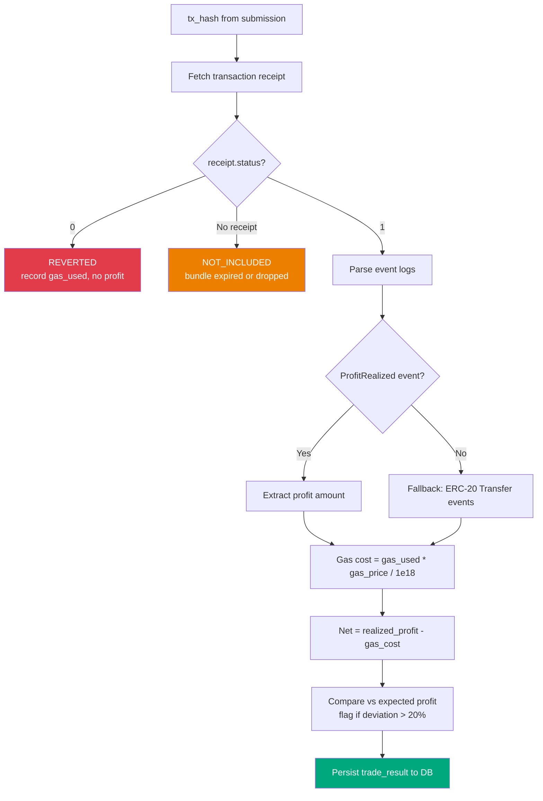

### Verification steps

1. Fetch transaction receipt
2. Check `status`: 1 = success, 0 = reverted
3. If successful:
   - Extract `ProfitRealized` event from logs (or fallback to Transfer events)
   - Calculate gas cost: `gas_used * effective_gas_price / 1e18`
   - Net profit: `realized_profit - gas_cost`

### PnL reconciliation

Compares expected profit (from pricing) vs. actual realized profit:

```
deviation     = actual - expected
deviation_pct = deviation / expected * 100
```

Deviations > 20% are flagged and logged.  Consistent deviations in one
direction indicate the cost model needs recalibration.

---

## 10. Data Models (`models.py`)

### MarketQuote

```
dex, pair, buy_price, sell_price, fee_bps, fee_included
volume_usd, liquidity_usd, quote_timestamp
```

### Opportunity

```
pair, buy_dex, sell_dex, chain, trade_size
cost_to_buy_quote, proceeds_from_sell_quote
gross_profit_quote, net_profit_quote, net_profit_base
dex_fee_cost_quote, flash_loan_fee_quote, slippage_cost_quote, gas_cost_base
warning_flags, liquidity_score, is_cross_chain
```

All financial fields are `Decimal`.  Float-to-Decimal conversion goes through
`str()` to avoid IEEE-754 precision loss.

---

## 11. Configuration (`config.py`)

### Key config fields

| Field | Type | Example | Purpose |
|-------|------|---------|---------|
| `pair` | str | `"WETH/USDC"` | Primary trading pair |
| `trade_size` | Decimal | `1.0` | Trade amount in base asset |
| `min_profit_base` | Decimal | `0.005` | Hard minimum profit (WETH) |
| `flash_loan_fee_bps` | int | `9` | Aave V3: 9, Balancer: 0 |
| `slippage_bps` | int | `15` | Base slippage estimate |
| `dexes` | list | 2+ required | DEX configs with chain + type |
| `chain_execution_mode` | dict | `{"arbitrum": "live"}` | Per-chain mode |

### Validation rules

- At least 2 DEXes required
- `trade_size > 0`
- `flash_loan_provider` must be `"aave_v3"` or `"balancer"`
- Fee and slippage BPS in `[0, 9999]`

---

## 12. Supported DEXes & Chains

### Chains

| Chain | Gas cost | Min spread | RPC source |
|-------|----------|------------|------------|
| Ethereum | ~$2-5 | 0.40% | Alchemy |
| Arbitrum | ~$0.10 | 0.20% | Alchemy |
| Base | ~$0.05 | 0.15% | Alchemy |
| Optimism | ~$0.05 | 0.15% | Infura/public |
| Polygon | ~$0.01 | 0.20% | Alchemy |
| BSC | ~$0.10 | 0.20% | Public |
| Avalanche | ~$0.10 | 0.25% | Alchemy |

### DEX types

| Type | Protocol | Quote method |
|------|----------|--------------|
| `uniswap_v3` | Uniswap V3 | `QuoterV2.quoteExactInputSingle()` |
| `sushi_v3` | SushiSwap V3 | Same ABI as Uniswap V3 |
| `pancakeswap_v3` | PancakeSwap V3 | Same ABI, different addresses |
| `velodrome_v2` | Velodrome (Optimism) | `Router.getAmountOut()` |
| `aerodrome` | Aerodrome (Base) | Same as Velodrome |
| `balancer_v2` | Balancer | `Vault.queryBatchSwap()` |
| `curve` | Curve | Pool-specific `get_dy()` |

---

## 13. Flash Loan Arbitrage Sequence

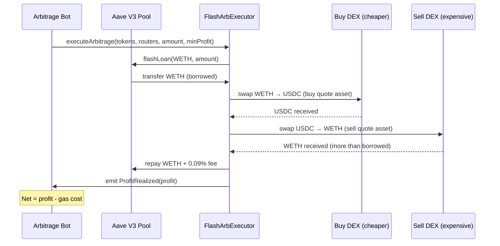

---

## 14. End-to-End Decision Flow

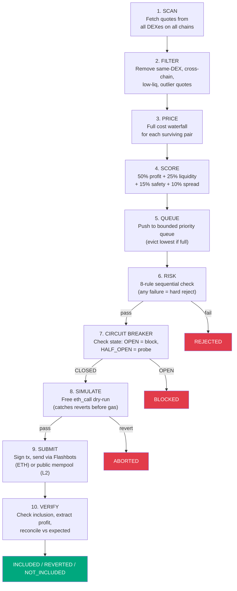

At every numbered step, a negative outcome stops the pipeline for that
opportunity.  The philosophy is **capital preservation > profit** — missing a
trade is always better than losing money.

---

## 15. Database Schema (key tables)

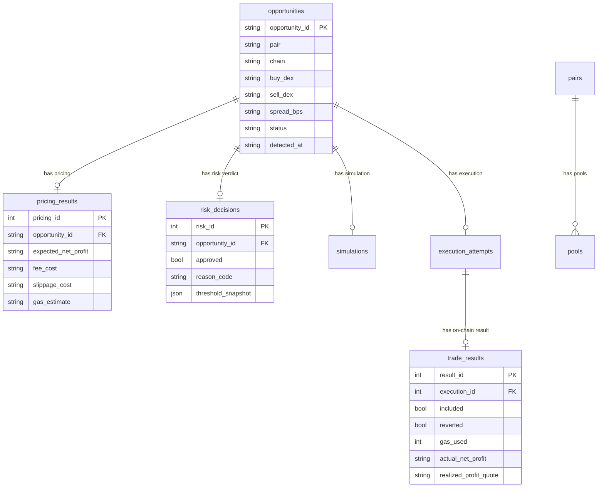
